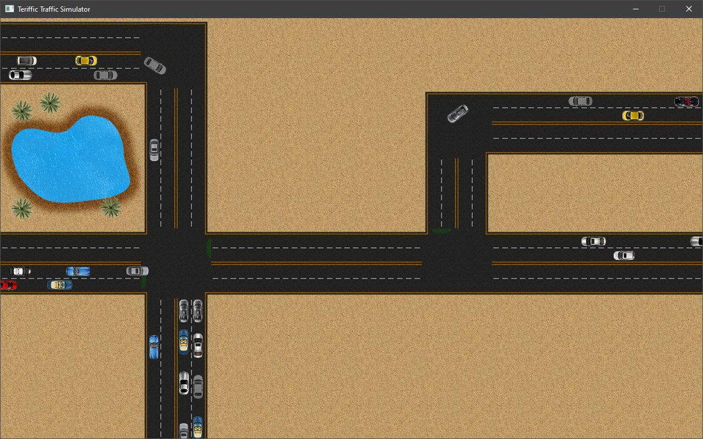
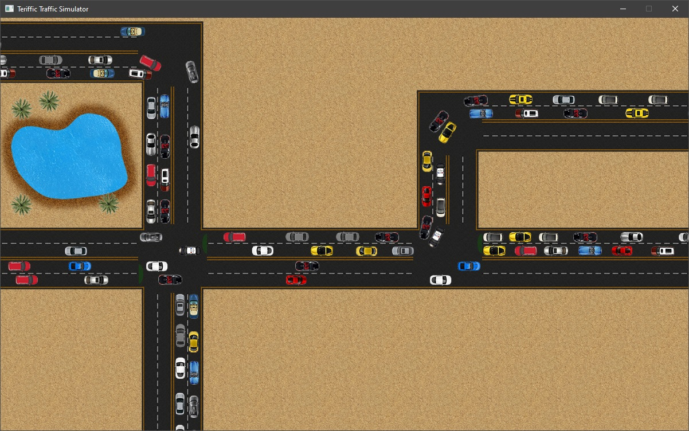

# Terrific Traffic Simulator

Well not that terrific, but a simple traffic simulator based on
[Intelligent Driver Model](https://en.wikipedia.org/wiki/Intelligent_driver_model),
and inspired by [this](https://github.com/volkhin/RoadTrafficSimulator) project.

This exercise project was my final project in the second semester of university for
advanced programming course.

The project was created using Visual Studio 2015 and [SDL2](https://www.libsdl.org/).

Back then, using [this tutorial](https://lazyfoo.net/tutorials/SDL/52_hello_mobile/index.php)
(which has been changed since then),
I was able to build the project for Android OS.

You can download binaries for Windows and Android from releases.

_I'm not a C++ developer, and I'm not really much familiar with Visual Studio,
so there may be some unnecessary files and/or other awkward goofs._ 

## Screenshots

